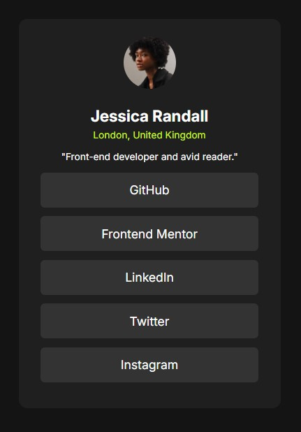

# Frontend Mentor - Social links profile solution

This is a solution to the [Social links profile challenge on Frontend Mentor](https://www.frontendmentor.io/challenges/social-links-profile-UG32l9m6dQ). 
## Table of contents

- [Overview](#overview)
  - [Screenshot](#screenshot)
  - [Links](#links)
- [My process](#my-process)
  - [Built with](#built-with)
  - [What I learned](#what-i-learned)
- [Author](#author)

## Overview

### Screenshot

### Links

- Solution URL: [Github](https://github.com/Muhammad-Taus/Front-End-Mentor-Social-Links-Profile)
- Live Site URL: [Live site URL](https://your-live-site-url.com)

## My process

### Built with

- Semantic HTML5 markup
- CSS custom properties
- Flexbox
- Mobile-first workflow
- Transition CSS
- Media Queries

### What I learned

I practiced my CSS skills after quite a long time. I used media queries and transitions on the hover effect.

## Author

- Frontend Mentor - [@Muhammad-Taus](https://www.frontendmentor.io/profile/Muhammad-Taus)
